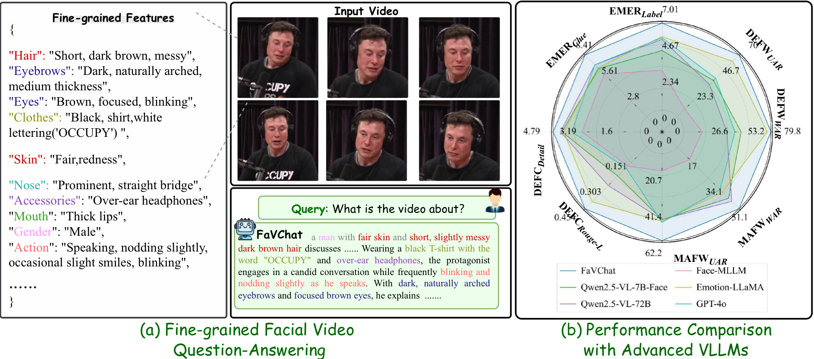
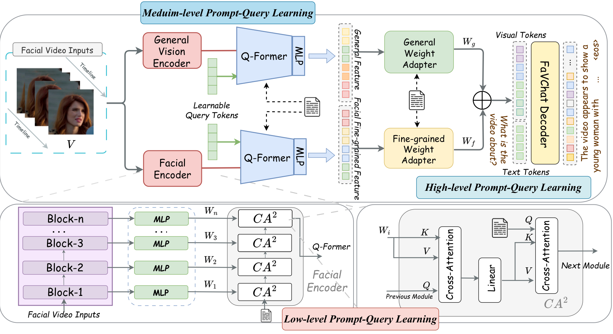
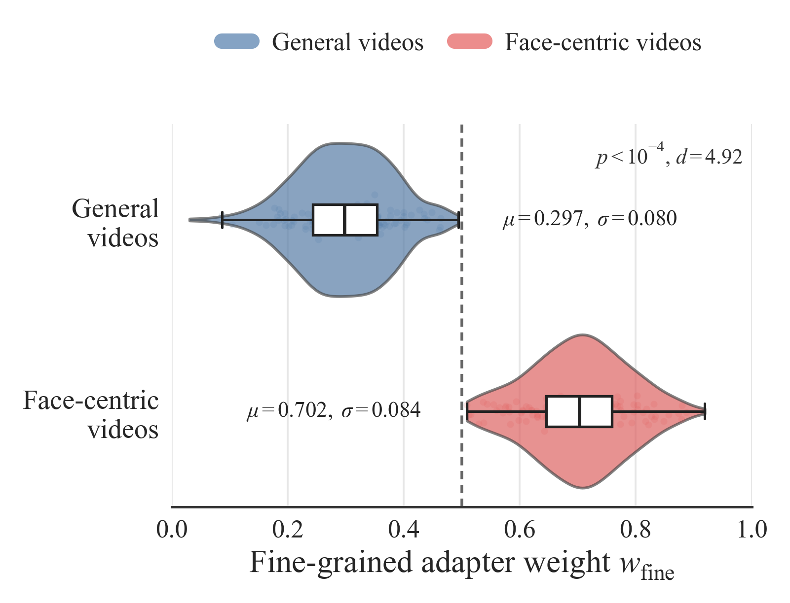
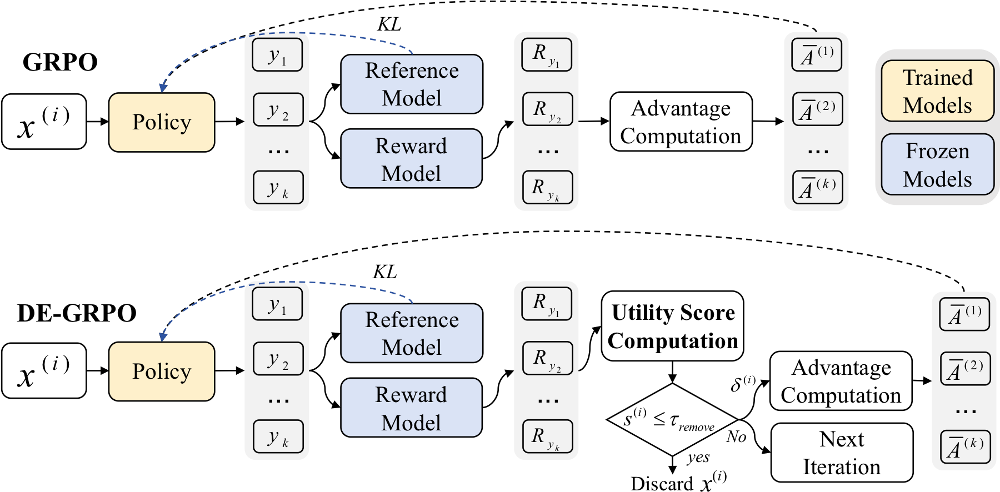
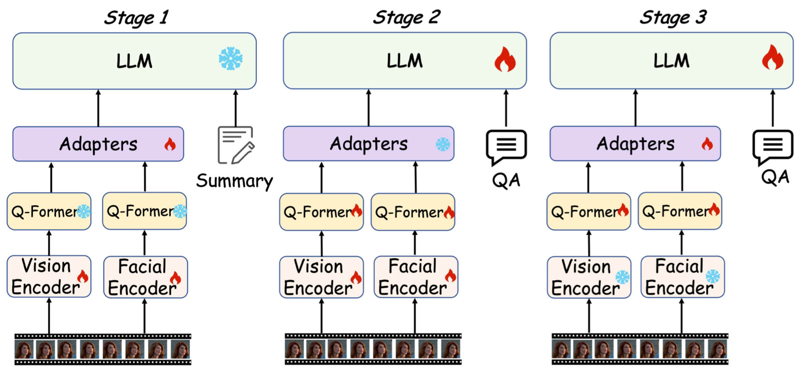
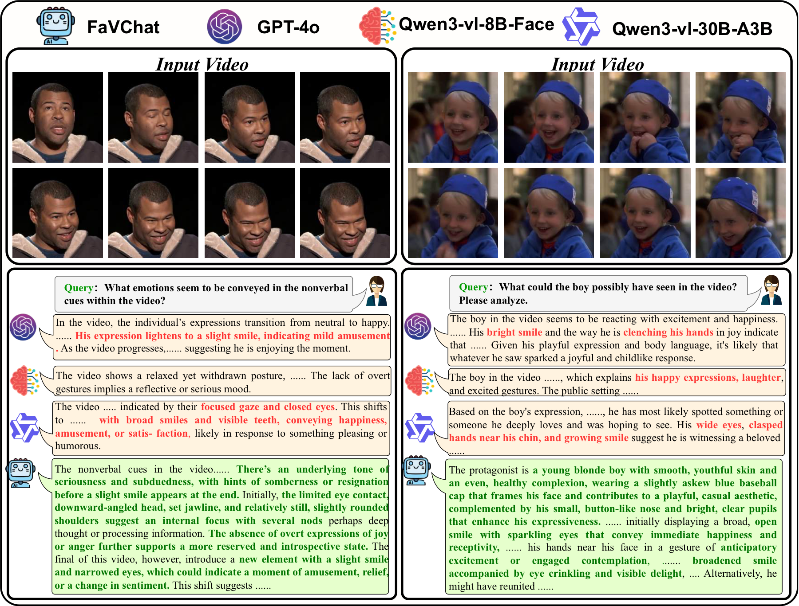
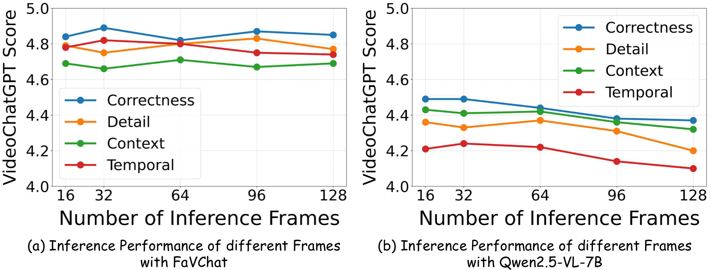

<div align="center">

# FaVChat

### Hierarchical Prompt-Query Guided Facial Video Understanding with Data-Efficient GRPO

FaVChat is a facial video large language model for fine-grained reasoning over
facial attributes, expressions, emotions, and subtle dynamic cues.

[Overview](#overview) | [Highlights](#highlights) | [Results](#results) | [Quick Start](#quick-start) | [Training](#training) | [Code Map](#code-map)

</div>

<p align="center">
  
</p>

## Overview

Existing video LLMs usually rely on prompt-agnostic visual encoders: they encode
the video first, then inject the user prompt near the final multimodal fusion
stage. This design can miss task-critical facial evidence, especially when the
answer depends on small appearance details, micro-expressions, or temporal
facial motions.

FaVChat addresses this with a prompt-guided facial video understanding pipeline:

- **Hierarchical prompt-query visual encoding** introduces user-query guidance
  at low, middle, and high visual levels.
- **Dedicated facial and general visual streams** preserve both subtle facial
  cues and broader visual context.
- **Data-Efficient GRPO (DE-GRPO)** prioritizes high-utility samples during
  reinforcement learning, improving alignment under limited high-quality data.
- **FaVChat-170K** provides about 60K facial videos and 170K question-answer
  pairs for fine-grained facial video reasoning.

<p align="center">
  
</p>

## Highlights

### Prompt-query visual encoding

FaVChat augments a general vision encoder with a dedicated facial encoder and
uses query guidance throughout the visual hierarchy:

| Level | Module | Purpose |
| --- | --- | --- |
| Low level | Cross-layer prompt-query aggregation | Retains shallow fine-grained facial cues from intermediate Transformer layers. |
| Middle level | Q-Former query extraction | Converts dense visual features into compact query-aligned visual tokens. |
| High level | Text-conditioned weight adapters | Dynamically balances general and facial features according to the prompt. |

<p align="center">
  
</p>

### Data-Efficient GRPO

DE-GRPO extends GRPO from response-level comparison to sample-level data
management. It estimates each sample's utility using reward separability and
gradient sensitivity, then maintains a recurrent sample state to discover,
exploit, cool down, or remove training samples.

<p align="center">
  
</p>

### Progressive pre-training

FaVChat uses a three-stage training paradigm aligned with the three prompt-query
levels:

1. Train visual encoders and adapters on 60K video-summary pairs.
2. Train Q-Formers on 170K video QA pairs.
3. Train adapters, Q-Formers, and the LLM on 110K emotion-intensive QA pairs.

<p align="center">
  
</p>

## Dataset

FaVChat-170K is built from CelebV-HQ, FERV39K, HMDB51, and YouTube Faces, then
unified with fine-grained feature extraction and GPT-4o based summary/QA
generation.

| Dataset | VQA data | Videos | Avg. caption tokens | Avg. attributes per caption | Total attributes |
| --- | ---: | ---: | ---: | ---: | ---: |
| HMDB51 | No | 6,766 | 13.1 | 2.3 | 23 |
| YouTube Faces | No | 3,425 | - | - | 11 |
| FERV39K | No | 39,546 | 11.3 | 1.3 | 7 |
| CelebV-HQ | No | 35,666 | - | - | 83 |
| **FaVChat-170K** | **170K QA pairs** | **61,007** | **100.7** | **23.4** | **103** |

Expected local layout:

```text
src/r1-v/FaVChat-data/
  FaVChat-170k.json
  FaVChat-COT-170k.json
  ...
```

Place all referenced videos and images under `src/r1-v/FaVChat-data/` following
the `path` fields in the dataset JSON files.

## Results

### Fine-grained facial video QA

FaVChat achieves the best overall results on the held-out 2,000-sample test set
and DFEC textual emotion analysis metrics reported in the paper.

| Method | LLM size | Test(2000) | Correctness | Detail | Context | Temporal | CIDEr | ROUGE-L | AutoDQ |
| --- | ---: | ---: | ---: | ---: | ---: | ---: | ---: | ---: | ---: |
| Qwen2.5-VL-7B | 7B | 7.84 | 4.49 | 4.36 | 4.43 | 4.21 | 0.261 | 0.254 | 0.417 |
| Qwen2.5-VL-72B | 72B | 8.47 | 4.61 | 4.47 | 4.59 | 4.78 | 0.281 | 0.317 | 0.453 |
| Qwen3-VL-8B | 8B | 7.99 | 4.49 | 4.37 | 4.41 | 4.33 | 0.262 | 0.257 | 0.421 |
| Qwen3-VL-30B-A3B | 30B | 8.44 | 4.63 | 4.51 | 4.57 | 4.81 | 0.304 | 0.331 | 0.461 |
| GPT-4o | - | 7.67 | 4.22 | 3.97 | 4.48 | 3.90 | 0.264 | 0.213 | 0.432 |
| FaceTrack-MM | 7B | 7.47 | 4.42 | 4.30 | 4.60 | 4.26 | 0.418 | 0.473 | 0.483 |
| Qwen2.5-VL-7B-Face | 7B | 8.64 | 4.51 | 4.41 | 4.45 | 4.22 | 0.274 | 0.261 | 0.463 |
| Qwen3-VL-8B-Face | 8B | 8.87 | 4.58 | 4.46 | 4.47 | 4.51 | 0.297 | 0.312 | 0.429 |
| **FaVChat-Qwen2.5** | **7B** | **8.89** | **4.84** | **4.79** | **4.69** | **4.78** | **0.443** | **0.454** | **0.487** |
| **FaVChat-Qwen3** | **8B** | **9.01** | **4.87** | **4.82** | **4.74** | **4.81** | **0.447** | **0.469** | **0.523** |

### Zero-shot emotion classification

| Method | Modality | DFEW UAR | DFEW WAR | MAFW UAR | MAFW WAR |
| --- | --- | ---: | ---: | ---: | ---: |
| Emotion-LLaMA | Audio + Video | 64.21 | 77.06 | - | - |
| MMA-DFER | Audio + Video | 66.01 | 77.51 | 44.11 | 58.52 |
| Finecliper | Video | 65.98 | 76.21 | 45.01 | 56.91 |
| Qwen2.5-VL-7B-Face | Video | 46.78 | 57.93 | 44.13 | 50.17 |
| **FaVChat** | **Video** | **70.01** | **79.79** | **51.09** | **62.17** |

<p align="center">
  
</p>

## Ablations

| Variant | DFEW WAR | MAFW WAR |
| --- | ---: | ---: |
| **FaVChat** | **79.79** | **62.17** |
| w/o facial encoder | 55.01 | 55.01 |
| w/o CA2 module | 70.04 | 57.49 |
| w/o adapters | 72.53 | 58.31 |

<p align="center">
  
</p>

## Quick Start

### 1. Environment

This repository targets Python 3.10+ and GPU training/inference with PyTorch,
vLLM, DeepSpeed, and Qwen-VL utilities.

```bash
cd code/FaVChat
bash setup.sh
```

The setup script installs:

- local `qwen_vl_utils` from `src/qwen-vl-utils`
- local FaVChat/Open-R1 package from `src/r1-v`
- `vllm==0.7.2`, `deepspeed`, `wandb`, `tensorboardx`, `torchvision`, and related dependencies

### 2. Inference

Edit the model path, video path, and question in `src/inference_example.py`:

```python
model_path = "FaVChat/FaVChat-7B"
video_path = "./src/example_video/video1.mp4"
question = "Describe the person's facial expression and motion in detail."
```

Then run:

```bash
python src/inference_example.py
```

The default prompt requests reasoning in `<think>...</think>` and a final answer
in `<answer>...</answer>`.

## Training

### Supervised fine-tuning

```bash
bash src/scripts/run_favchat_sft.sh
```

Default inputs:

- dataset: `src/r1-v/FaVChat-data/FaVChat-COT-170k.json`
- base model: `Qwen/Qwen2.5-VL-7B-Instruct`
- output: `src/r1-v/log/Qwen2.5-VL-7B-FaVChat-SFT`

### DE-GRPO training

Before running GRPO, update `--model_name_or_path` in
`src/scripts/run_favchat_grpo.sh` from `SFT Model Path` to your SFT checkpoint.

```bash
bash src/scripts/run_favchat_grpo.sh
```

Default inputs:

- dataset: `src/r1-v/FaVChat-data/FaVChat-170k.json`
- DeepSpeed config: `src/r1-v/local_scripts/zero3.json`
- generations per prompt: `8`
- output: `src/r1-v/log/Qwen2.5-VL-7B-FaVChat-GRPO`

## Evaluation

The repository includes a benchmark runner for several general video QA
benchmarks:

```bash
bash src/eval_bench.sh
```

Update `model_paths` and `file_names` inside `src/eval_bench.sh` before use.
The evaluator loads prompt files from `src/r1-v/Evaluation/` and writes outputs
to `src/r1-v/eval_results/`.

## Code Map

| Path | Description |
| --- | --- |
| `src/r1-v/src/open_r1/favchat_grpo.py` | DE-GRPO training entry. |
| `src/r1-v/src/open_r1/sft_favchat.py` | SFT training entry. |
| `src/r1-v/src/open_r1/trainer/favchat_grpo_trainer.py` | FaVChat GRPO trainer and data-efficient RL logic. |
| `src/r1-v/src/open_r1/favchat_components.py` | Hierarchical prompt-query modules and adapters. |
| `src/scripts/run_favchat_sft.sh` | Multi-GPU SFT launch script. |
| `src/scripts/run_favchat_grpo.sh` | Multi-GPU DE-GRPO launch script. |
| `src/inference_example.py` | Minimal vLLM inference example. |
| `assets/readme/` | README figures copied from the paper assets. |

## Citation

```bibtex
@article{zhao2026favchat,
  title  = {FaVChat: Hierarchical Prompt-Query Guided Facial Video Understanding with Data-Efficient GRPO},
  author = {Zhao, Fufangchen and Tan, Songbai and Qiu, Xuerui and Xu, Linrui and Jiang, Wenhao and Zheng, Jinkai and Fan, Hehe and Gao, Jian and Yan, Danfeng and Li, Ming},
  year   = {2026}
}
```

## Acknowledgements

This codebase includes FaVChat training and evaluation components built on the
Open-R1 style training stack, Qwen-VL utilities, vLLM, DeepSpeed, and PyTorch.
